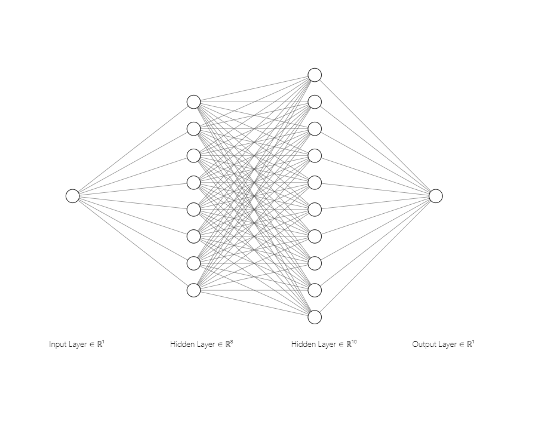
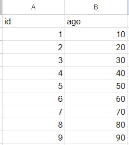
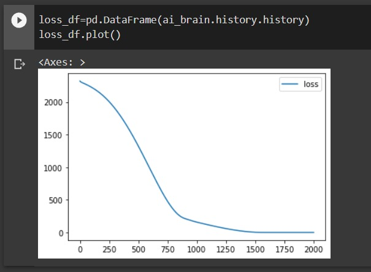
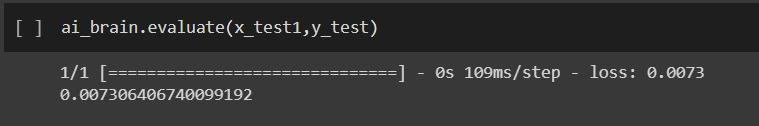
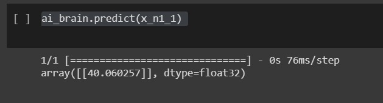

# Developing a Neural Network Regression Model

## AIM:

To develop a neural network regression model for the given dataset.

## THEORY:

Explain the problem statement

## Neural Network Model


## DESIGN STEPS

### STEP 1:

Loading the dataset

### STEP 2:

Split the dataset into training and testing

### STEP 3:

Create MinMaxScalar objects ,fit the model and transform the data.

### STEP 4:

Build the Neural Network Model and compile the model.

### STEP 5:

Train the model with the training data.

### STEP 6:

Plot the performance plot

### STEP 7:

Evaluate the model with the testing data.

## PROGRAM:
```
DEVELOPED BY: SUBRAMANIYA PILLAI B
REG NO      : 212221230109
```
```
from sklearn.model_selection import train_test_split
from sklearn.preprocessing import MinMaxScaler
from tensorflow.keras import layers
from tensorflow.keras.layers import Dense
from tensorflow.keras.models import Sequential

x=df[['id']].values
y=df[['age']].values
x_train,x_test,y_train,y_test=train_test_split(x,y,test_size=0.33,random_state=33)
scaler = MinMaxScaler()
scaler.fit(x)
x_n = scaler.fit_transform(x)

x_train1=scaler.transform(x_train)
x_train1

ai_brain=Sequential([
    Dense(8,activation = 'relu'),
    Dense(10,activation = 'relu'),
    Dense(1)
])
ai_brain.compile(optimizer='rmsprop',loss='mse')
ai_brain.fit(x_train1,y_train,epochs=2000)

loss_df=pd.DataFrame(ai_brain.history.history)
loss_df.plot()
x_test1=scaler.transform(x_test)
ai_brain.evaluate(x_test1,y_test)
x_n1=[[4]]
x_n1_1=scaler.transform(x_n1)

ai_brain.predict(x_n1_1)
```

## Dataset Information:
### DATASET:


## OUTPUT:

### Training Loss Vs Iteration Plot



### Test Data Root Mean Squared Error


### New Sample Data Prediction


## RESULT
Thus a neural network regression model for the given dataset is written and executed successfully.


